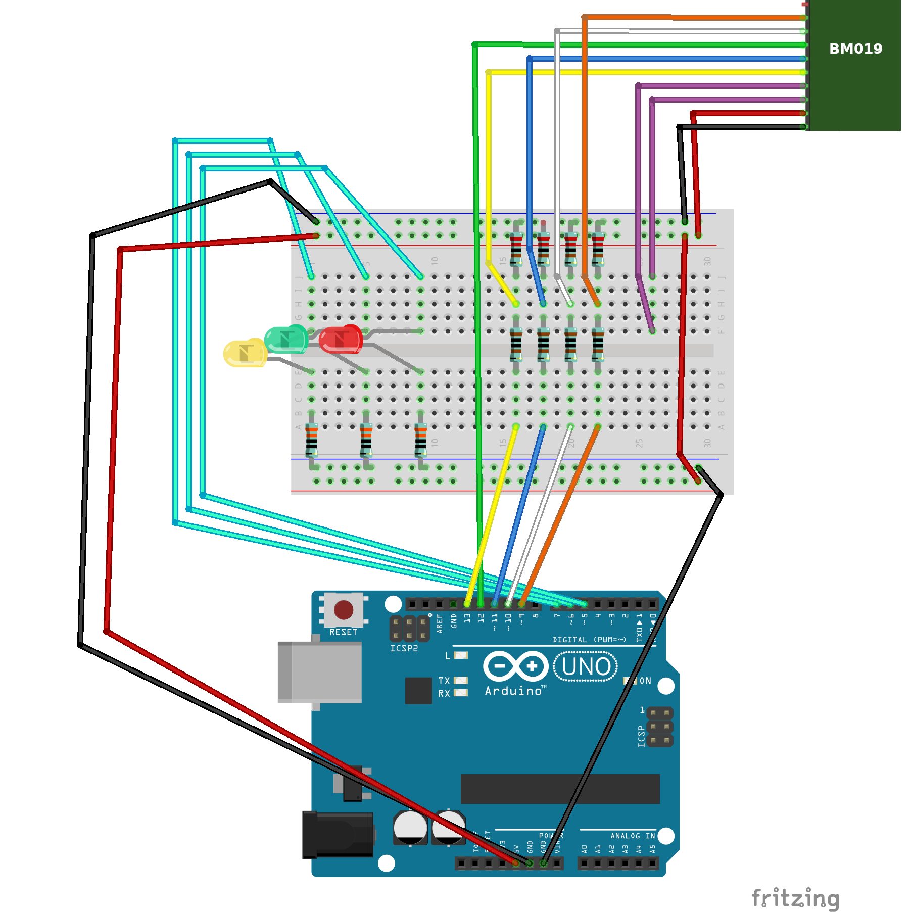

# Arduino-BM019-RFIDInLibraries

This repo contains a PoC for using an Arduino UNO and a BM019 NFC/RFID module from [Solutions Cubed](https://www.solutions-cubed.com/) for communicating with RF tags for library materials formatted using ISO 28560-3 "Information and documentation - RFID in libraries - Fixed length encoding" / DS/INF 28560 "The Danish Data Model".

It also contains a Python script using the [Bottle Framework](https://bottlepy.org/) which can be used for setting up a connection between the Arduino and the [Alma](https://developers.exlibrisgroup.com/alma/integrations/rfid/information_for_rfid_vendor/) library system from Ex Libris via a local web server.

The code for communication with the BM019 module is based on/copied from examples described in a [blog post by Solutions Cubed]( http://blog.solutions-cubed.com/near-field-communication-nfc-with-the-arduino/) (at the time of writing this the blog could not be accessed but it could be reached via the [Wayback Machine](https://web.archive.org)).

*Intended as a prototype and for inspiration, please* ***DO NOT USE IN PRODUCTION*** *without a serious code review.*

## Installation

Compile the ino-file and upload it to an Arduino board using the [Arduino IDE](https://www.arduino.cc/en/software). For testing purposes the serial monitor in the IDE can be used for communication with the board.

Please refer to the [Fritzing](https://fritzing.org/) sketch for wiring.

## Usage

The Arduino is expecting the following commands sent as strings:  
"1" - Read tag  
"2" - Read security  
"3" - Set security to on  
"4" - Set security to off  
"5<barcode>" - Write <barcode>, max 16 chars, to tag  
"9" - Stop scanning for tags  

The arduino replies in the following JSON-ish format, the reply can differ somewhat for different commands:  
{"r":"<result>","e":"<error>","s":"<security>","p":"<payload>","c1":"<crc_recorded>","c1":"<crc_calculated>"}  
<result> - success of the command, 1 for succes and 0 for failure  
<error> - error message if a command fails  
<security> - security status, 1 for on and 0 for off or unknown  
<payload> - contains the barcode when applicable  
<crc_recorded> - CRC recorded in the tag when applicable  
<crc_calculated> - CRC calculated from the other fields in the tag when applicable  

Please refer to ISO 28560-1 and your own implementation of the standard for details on how security is handled in your tags.